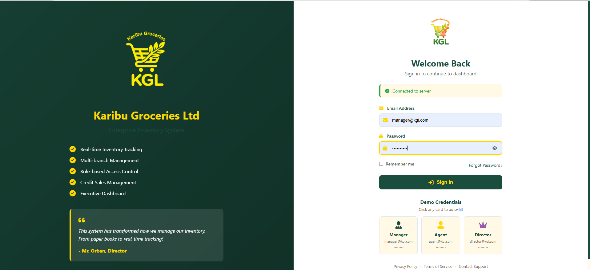
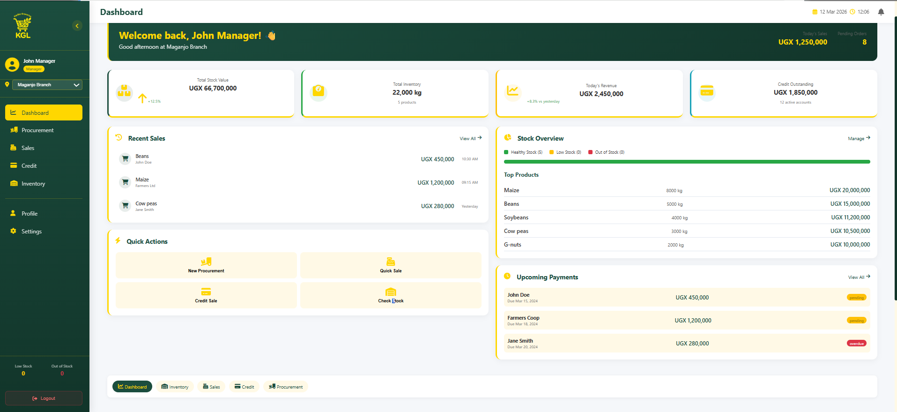
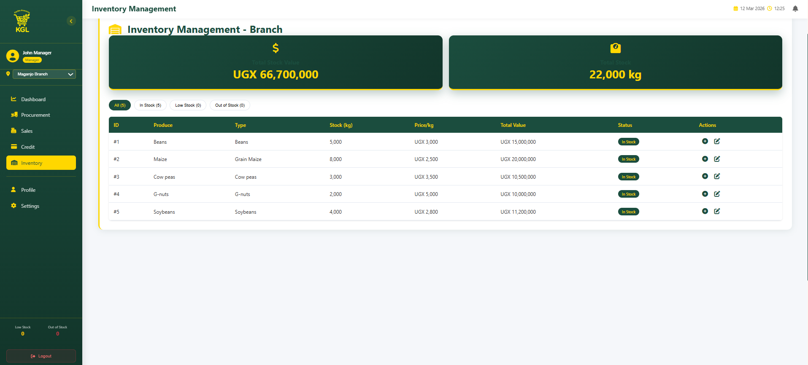
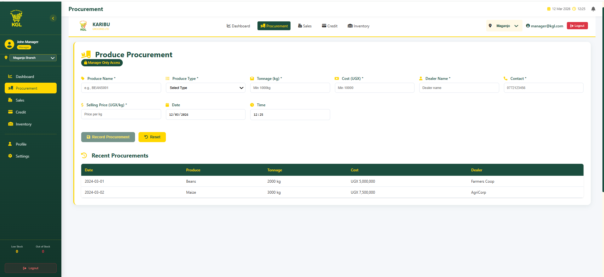
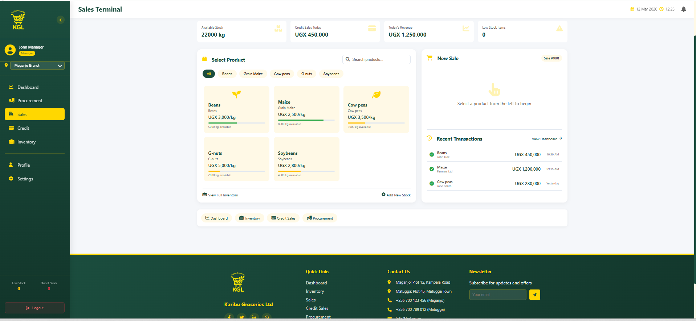
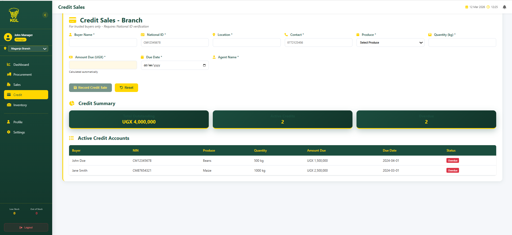
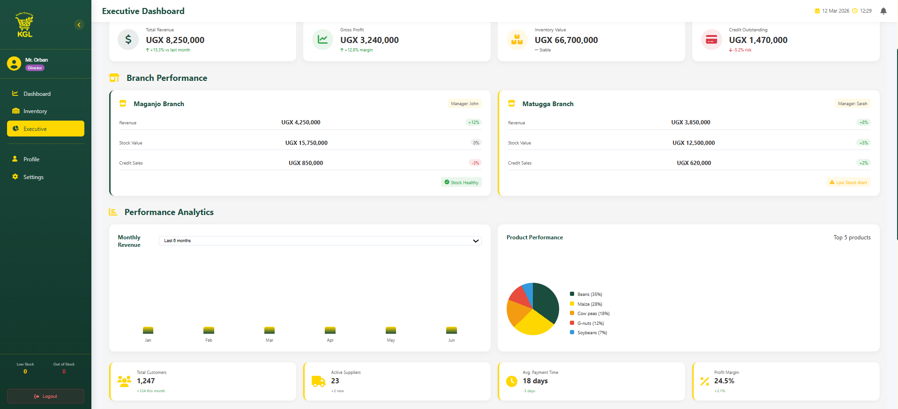

# 🌾 KGL Enterprise System

### Karibu Groceries Ltd – Digital Inventory & Sales Platform

A **full-stack enterprise inventory and sales management system** built for **Karibu Groceries Ltd**, a wholesale produce distributor with branches in **Maganjo** and **Matugga**.

The system replaces paper-based processes with a **real-time digital platform for procurement, inventory tracking, sales management, and credit monitoring**.

---

# 🌐 Live Application

Frontend
https://kgl-enterprise-system.netlify.app/login

Backend API
https://kgl-system-3.onrender.com

API Health Check
https://kgl-system-3.onrender.com/api/health

⚠️ Backend hosted on Render free tier.
First request may take **30–60 seconds** to wake up.

---

# 🖼️ System Screenshots

## Login Page

Secure login with role-based authentication.

---

## Manager Dashboard

Provides quick access to:

• Inventory overview
• Sales summary
• Procurement statistics
• Branch performance

---

## Inventory Management

Features:

• Real-time stock levels
• Low-stock alerts
• Branch-specific inventory
• Stock availability validation

---

## Procurement Module

Managers can:

• Add new stock
• Record supplier deliveries
• Validate minimum purchase quantities

---

## Sales Module

Sales agents can:

• Process cash sales
• Check stock availability
• Automatically reduce inventory

---

## Credit Sales

Allows tracking of:

• Customer credit purchases
• National ID validation
• Due date monitoring

---

## Executive Reports

Directors can view:

• Aggregated revenue reports
• Branch comparison analytics
• Sales summaries

---

# ✨ Key Features

## Role-Based Access Control

Manager
Full system access

Agent
Sales and credit operations

Director
View reports and analytics

---

## Business Modules

Procurement
Stock intake with validation

Inventory Management
Real-time stock tracking

Sales Processing
Immediate stock deduction

Credit Sales
Customer credit monitoring

Executive Dashboard
Analytics and reporting

---

# 🛠 Tech Stack

Frontend

Vue.js 3
Pinia
Vue Router
Axios
Vue Toastification

Backend

Node.js
Express.js
MongoDB
Mongoose
JWT Authentication
bcryptjs

Deployment

Frontend → Netlify
Backend → Render

---

# 🔐 Security

JWT authentication
Password hashing
Input validation
Route protection
Role-based authorization

---

# 📁 Project Structure

kgl-enterprise-system

backend
• controllers
• models
• routes
• middleware
• server.js

frontend
• components
• views
• stores
• router
• services

README.md

---

# 🚀 Running Locally

Backend

cd backend
npm install
npm run dev

Server runs on

http://localhost:3000

---

Frontend

cd frontend
npm install
npm run dev

App runs on

http://localhost:5173

---

# 🧪 Demo Credentials

Manager
[manager@kgl.com](mailto:manager@kgl.com)
manager123

Agent
[agent@kgl.com](mailto:agent@kgl.com)
agent123

Director
[director@kgl.com](mailto:director@kgl.com)
director123

---

# 🧪 How to Test

1 Open the live system

https://kgl-enterprise-system.netlify.app/login

2 Login with demo credentials

3 Test modules

Manager
Add procurement
Manage inventory

Agent
Process sales
Record credit

Director
View reports

---

# 🚀 Deployment

Frontend
Netlify

Backend
Render

Both automatically deploy from GitHub.

---

# 👨‍💻 Author

Mazin Ahmed Ibrahim

GitHub
https://github.com/mazinahmed2010

---

# ⭐ Support

If you like this project please **give it a star on GitHub**.

---

Built with ❤️ using Vue.js and Node.js
